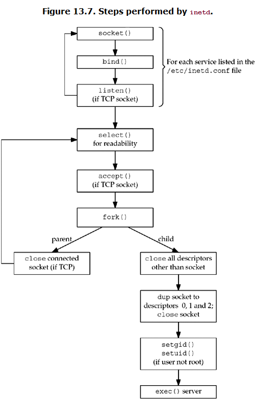

##### 13.1 ways to start a daemon
* system start up, via script
* inetd superserver
* ...

##### 13.2 syslogd daemon
* BSD implemntation
  * configuration /etc/syslog.conf
  * a unix domain socket is created and bound to /var/run/log
  * a udp socket is created and bound to port 514
  * pathname /dev/klog is opened (for any error input)

##### 13.3 syslog function
* logging messages from a daemon is to call this function

##### 13.4 daemon_init function
* to daemonize the process

##### 13.5 inetd daemon

* 4.3BSD release provide an Internet superserver: inetd daemon
* Sloves:
*   1. simplifies writing daemon processes
*   2. allows a single process(inetd) to be waiting for incoming requests for multiple services

#### 13.6 daemon_inetd function

+ Action:
+  1. set daemon_proc for error functions
+  2. call openlog

+ Add service for inetd on ubuntu
+ 1. add entry in /etc/services file
+ 2. add entry in /etc/inetd.conf file (make sure executable file exist in the specified location, will trigger SIGHUP to inetd when adding this entry and after close this file)
+ 3. monitor port 9999 with `netstat -na | grep 9999`
+ 4. telnet ip/domain 9999 with another host and monitor the changes with step3

* [tips] the /var/log/syslog file contains the connection messages 
