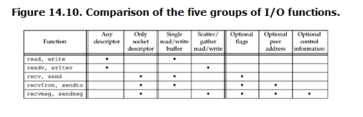

##### 14.2 socket timeouts
###### Three ways to place a timeout
* 1 call alarm, which generates `SIGALRM` when time expired
* 2 Block waiting for IO in `select`
* 3 use `SO_RCVTIMEO` and  `SO_SNDTIMEO` socket options

##### 14.4 readv and writev
* read into or wirte from one or more buffers with a single function call.
* datatype `struct iovec` are specified by `POSIX`

##### 14.5 recvmsg and sendmsg
* most general of all the IO functions

