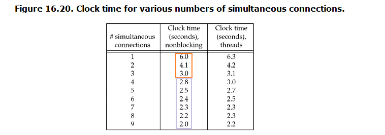
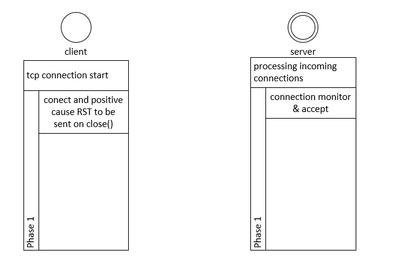

###### 16.1 Introduce
* socket calls block into four categories

| categories           | meaning    | notes |
| -------------------- | ---------- | ----- |
| Input operation      | read...    |       |
| Output operation     | write...   |       |
| Accept incoming conn | Accept...  |       |
| Init outgoing conn   | connect... |       |
|                      |            |       |

###### 16.2 nonblocking reads and write

* 1 get current fd value --- fcntl
* 2 set with `O_NONBLOCK` operation --- val | O_NONBLOCK
* 3 init fd and call select to minitor these fd(read/write)

###### 16.3 nonblocking connect

* connect immediately return with `EINPROGRESS`, but three-way handshake continues
* three use of `nonblocking connect`:
* 1. we can overlap other processing with the three-way handshake --- choose other processing to perform during this connection RTT (few msec to hundreds of msec)
* 2. we can establish multiple connections at the same time using this tech
* 3. we can specify a time limit for `select` (using for nonblocking connection)

* other details to handle:
* 1. connection is normally establish immediately if the server is on the same host
* 2. Berkeley-derived imp and POSIX have rules
*   * a) the desc becomes writable when the connection completes successfully
*   * b) the desc becomes readable and writable when connection ecounters an error

###### 16.4 example daytime client

* Handle interrupted connect: `call select` (select can distinguish completes and fails cases)

###### 16.5 nonblocking connection: Web client

* simultaneous connections
* performance: Most of the improvement is obtained with three simultaneous connections

###### 16.6 nonblocking accept
* if we using `select` to wait for incoming connections, we should not set the `listening` socket to nonblocking, because if select tells us that the connection is ready, accept should not block

* A timeing issue:

* brief desc:
*   1. clinet trigger RST (with ling option on socket)
*   2. server select capture the connection and queued the socket
*   3. RST arrived before accept this socket(causing this socket removed from the queue)
*   4. server calls accpet, and will block
