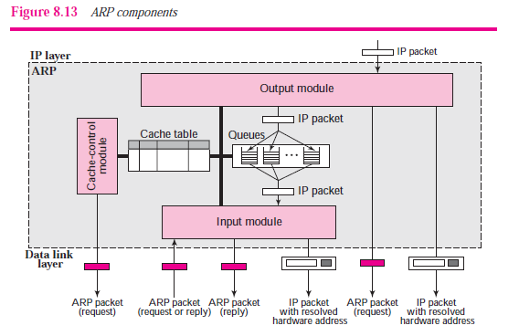
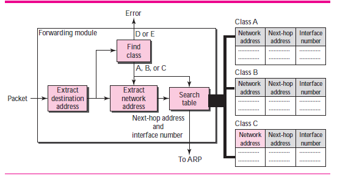

###### 17.2 ioctl function

* summary of networking ioctl requests
```
| cat       | request      | description | datatype       |
| --------- | ------------ | ----------- | -------------- |
| socket    | SIOCATMARK   |             | int            |
|           | SIOCSPGRP    |             | int            |
|           | SIOCGPGRP    |             | int            |
| file      | FIONBIO      |             | int            |
|           | FIOASYNC     |             | int            |
|           | FIONREAD     |             | int            |
|           | FIOSETOWN    |             | int            |
|           | FIOGETOWN    |             | int            |
| Interface | SIOCGIFCONF  |             | struct ifconf  |
|           | SIOCSIFADDR  |             | struct ifreq   |
|           | SIOCGIFADDR  |             | ...            |
|           | SIOCSIFFLAGS |             | ...            |
|           | ...          |             | ...            |
| ARP       | SIOCSARP     |             | struct arpreq  |
|           | SIOCGARP     |             | ...            |
|           | SIOCDARP     |             | ...            |
| routing   | SIOCADDRT    |             | struct rtentry |
|           | SIOCDELRT    |             | ...            |
| STREAMS   | I_xxx        |             | NA             |
```

###### 17.3 socket operations

* `SIOCATMARK` socket's read pointer is currently at the out-of-band mark(nonzero/zero)
* `SIOCGPGRP`  return either PID or PGID, pair with `SIOCSPGRP`
* `SIOCSPGRP`  set either PID or PGID to receive `SIGIO` or  `SIGURG` signal

###### 17.4 file operations

* `FIONBIO` nonblocking flag for the socket
* `FIOASYNC` this flag governs the receipt of `SIGIO`
* `FIONREAD` number of bytes currently in the socket receive buffer
* `FIOSETOWN` equivalent to `SIOCSPGRP`
* `FIOGETOWN` equivalent to `SIOCGPGRP`

###### 17.5 IF configuration

* user allocate a buffer and an `ifconf` structure
* kernel return `ifreq` structure list

###### 17.6 get_ifi_info function
* TBD --- remain for practice --- dive into source code

###### 17.7 IF operations

* `other requests` to set or get all other characteristics of the IF

###### 17.8 ARP cache operation
* ADD/DEL/GET an entry from the ARP cache


###### 17.9 routing table operations
* ADD/DEL an entry from routing table

