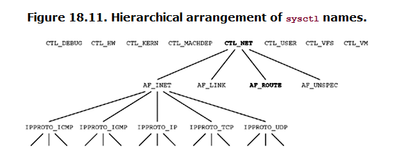

###### 18.1 Intr
* the only type of socket supported in the route domain is a `raw socket`
* types of operation supported on a routing socket
* 1. A process can send a msg to kernel by writing to a routing socket(like, rt entry add/del)
* 2. A process can read a msg from kernel on a routing socket (this is how kernel **notifies** a process that an ICMP redirect has been received and processed.)
* 3. A process can use `sysctl` function to either dump the routing table or list all configured IF

* `note: superuser privilegdes requried for most of the opeartions`

###### 18.2 Datalink socket address structure

* This data struct contains in some of the msg returned on a routing socket.
* Defined in <net/if_dl.h> maybe
```
  struct sockaddr_dl {
    uint8_t      sdl_len;
    sa_family_t  sdl_family;   /* AF_LINK */
    uint16_t     sdl_index;    /* system assigned index, if > 0 */
    uint8_t      sdl_type;     /* IFT_ETHER, etc. from <net/if_types.h> */
    uint8_t      sdl_nlen;     /* name length, starting in sdl_data[0] */
    uint8_t      sdl_alen;     /* link-layer address length */
    uint8_t      sdl_slen;     /* link-layer selector length */
    char         sdl_data[12]; /* minimum work area, can be larger;
                                  contains i/f name and link-layer address */
  };
```
* To aquire dl address --- to say, MAC address
* `#define LLADDR(s) ((caddr_t)((s)->sdl_data + (s)->sdl_nlen))`

###### 18.3 Reading & Writing

* there are 12 routing cmd, 5 of which can be issued by the process
* example shows msg type --- **RTM_GET**

###### 18.4 sysctl operations

* how to use this function to examine both the routing table and IF list

* sysctl is a general way to fetch and store OS parameters, we interested
* 1. dumping IF list
* 2. dumping rt
* 3. dumping ARP cache

###### 18.5 get_ifi_info FUNCTION (revisited)

###### 18.6 IF
* RFC 3493 defines four fucntions **deal with interface names and indexes**
