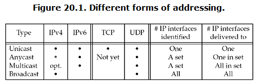

###### 20.1 Intr
* The important points:
* 1. Multicasting support is optional in IPv4, BUT mandatory in IPv6
* 2. Broadcasting support is not provided in IPv6.
* 3. Broadcasting and muticasting require datagram transport such as **UDP** or **raw IP**; they can not work with TCP

* Example use broadcasting:
* 1. ARP
* 2. DHCP
* 3. NTP (network time)
* 4. Routing daemons

###### 20.2 Broadcasting Addresses
* we denote a field containing all one bits as `-1`
* Two types of broadcast address
* 1. subnet-directed broadcast address {subnetid, -1} - this addressses all the interfaces on the specified subnet. Normally, **routers do not forward these broadcasts**.
* 2. Limited broadcast address {255.255.255.255}

###### 20.3 Unicast versus Broadcast

* unicast IP datagram is received by only the host specified.
* broadcast IP datagram are received by all the host within the same subnet, thus may cause `broadcast storm`

###### 20.4 dg_cli function using broadcasting

* all this function to broadcast to the standard UDP daytime server
* race constion arise

###### 20.5 Race conditions
* TBC
