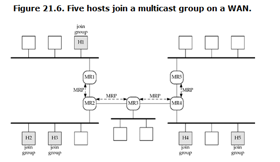
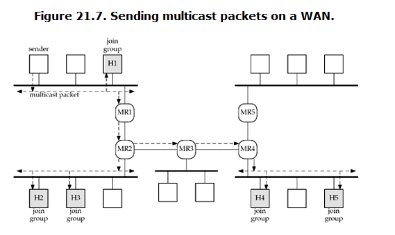

###### 21.1 Intr

###### 21.2 muticast addresses

* IPv4 --- class D addresses, are muticast addresses
* IPv6 --- the high-order byte of an IPv6 Multicast address has value `ff`
* Tips: there are special muticast address for IPv4 and IPv6

###### 21.3 muticasting VS broadcasting on a LAN

* for a processs to receive a multicast datagram, the process must `join` the group and `bind` the port.

###### 21.4 Multicast on WAN

* Multicasting is benefical on WANs
* Router MR# must support MRP (multicast routing protocol)
* Multicast join

  
* Send multicast packets on a WAN

  

###### 21.5 SSM --- source-specific multicast

* use pragmatic soultion to solve bounch of problems `multicasting on a WAN` faces

###### 21.6 multicast socket options

###### 21.7 mcast_join and related function
* refter to lib/mcast_join.c

###### 21.9 receiving IP multicast infrastructure session announcements

###### 21.10 sending and receiving

***
##### example
* SNTP --- simple network time protocol
