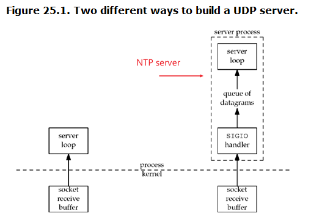

###### 25.1 Intr

* kernel notifies us with a signal when something happens on a decs.

###### 25.2 Signal IO for sockets

* use of `SIGIO` for socket requires process to perform:
* 1. a signal handler must be established for this signal
* 2. the socket owner must be set --- normally with `F_SETOWN` command of `fcntl`
* 3. siganl IO must be enabled for the socket --- normally with `F_SETFL` command of `fcntl` to turn on `O_ASYNC` flag

* the hard part is determining **what conditions** cause `SIGIO` to be generated for the socket owner. it depends on the underlying protocol

* SIGIO with UDP sockets
* the signal is generated whenever:
* 1. a datagram arrives for the socket
* 2. an asynchronous error occurs on the socket
  - Tip: UDP socket is connected

* SIGIO with TCP sockets
* conditions cause `SIGIO` to be generated
  - 1. a connection req has completed on a listening socket
  - 2. a disconnect req has been initiated
  - 3. a disconnect req has completed
  - 4. half of a connection has been shut down
  - 5. data has arrived on a socket
  - 6. data has been sent from a socket
  - 7. an asynchronous error occurred
* Tips:
  - 1. we should consider using SIGIO **only with** a listening TCP socket, because the only condition that generates SIGIO for a listening socket is the completion of a new connection
  - 2. no way to distinguish between socket IO (read/write) operation within the signal handler

* real-world use of signal-driven IO --- NTP server (use UDP)

  
* for NTP server, SIGIO handler records the time when datagram arrived, then datagram is queued for the main loop

###### 25.3 UDP echo server using `SIGIO`
* TBC: example similiar to NTP server
