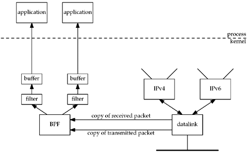
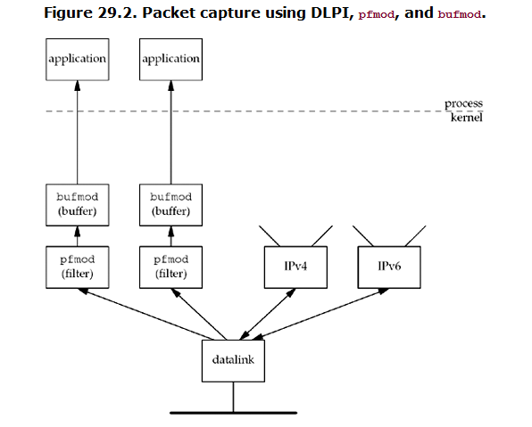

##### 29.1 Introduce
* Access to DL layer provides following capabilities:
* 1. the ability to watch the packets received by the DL --- less useful in switched network.
* 2. the ability to run certain programs as normal application instead of as the kernel --- ^_^ relief burden of the kernel.

###### three common methods to access DL
* 1. BPF --- BSD pakcet filter
* 2. DLPI --- SVR4 DL Provider Interface
* 3. `SOCK_PACKET` interface (linux)

###### third part lib
* 1. `libpcap` --- can make our programs independent of the `actual` DL access
* 2. DNS queries using this lib

##### 29.2 BPF


###### Three tech are used by BPF to reduce its overhead
+ 1. As the figure shows, BPF filter is within the kernel, which minizies the amount of data copied from BPF to the application
+ 2. only a portion of each packet is passed by BPF to the application --- this is called `snapshot length`, most application need only packet headers, not the packet data
+ 3. BPF buffers the data `destined` for an application, and is copied to the application only when `the buffer is full`, or `read timeout` expires.

##### 29.3 DLPI


* desc

##### 29.4 Linux: `SOCK_PACKET` & `PF_PACKET`

* To receive all frames
  ```
  fd = socket(PF_PACKET, SOCK_RAW, htons(ETH_P_ALL));        /* newer systems*/
  fd = socket(AF_INET, SOCK_PACKET, htons(ETH_P_ALL));      /* older systems*/
  ```
* Specifying a protocol of `ETH_P_xxx` tells the DL which type of frame to pass

* Differences comparing `BPF` & `DLPI`
* 1. kernel filtering is only available on newer systems
* 2. `SOCK_PACKET` provides no filtering by device

##### 29.5 libpcap
* further digging: tcpdump.org

##### 29.6 libnet
* libnet provides an interface to craft and inject arbitrary packets into the network
* futher digging: pakcetfactory.net

##### Examining UDP checksum field
