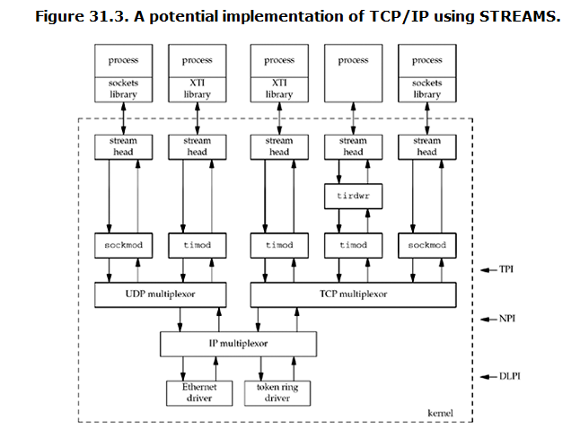
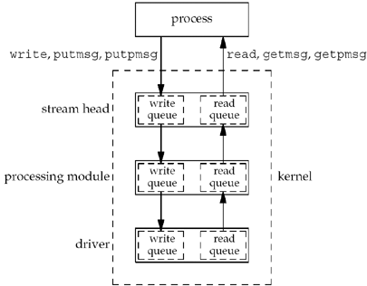

##### 31.1 Introduce
* STREAMS is a `framework`
* **STREAMS** system is different concept compared with `stream I/O system`, the later use function such as `fopen`, `fgets` and the like.

##### 31.2 Overview

* STREAMS provide a full-duplex connection between a process and a driver.

* each component in a stream --- the stream head, all processing modules, and the driver --- contains at least `one pair of queues`: a write queue and a read queue


* STREAMS message can be categorized as `high priority`, `priority band`,  or `normal`.
* Networking programing often use band1 and band0 for expedited data and normal data respectively.

##### 31.3 `getmsg` & `putmsg` func
```
  #include <stropts.h>

  int getmsg(int fd, struct strbuf *ctlptr, struct strbuf *dataptr, int *flagsp) ;

  int putmsg(int fd, const struct strbuf *ctlptr, const struct strbuf *dataptr, int flags) ;

```

##### 31.4 For SVR4
```
  #include <stropts.h>

  int getpmsg(int fd, struct strbuf *ctlptr, struct strbuf *dataptr, int *bandp, int *flagsp) ;

  int putpmsg(int fd, const struct strbuf *ctlptr, const struct strbuf *dataptr, int band, int flags) ;

```
##### 31.5 `ioctl`

##### 31.6 TPI
* TBD
