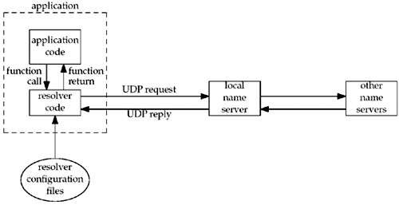

##### 11.2 DNS



##### 11.3 gethostbyname

##### 11.4 gethostbyaddr

* takes a binary IPv4 addr and tries to find the hostname

##### 11.5 getservbyname & getservbyport

##### 11.6 getaddrinfo
* **getaddrinfo** sovles the problem of converting hostnames and service names into socket address structures.

##### 11.7 gai_strerror
* nonzero error return values from getaddrinfo

##### 11.18 re-entrant function

```
main ()
{
     struct hostent *hptr;
     ...
     signal (SIGALRM, sig_alrm);
     ...
     hptr = gethostbyname ( ... ) ;
     ...
}
void
sig_alrm (int signo)
{
    struct hostent *hptr;
    ...
    hptr = gethostbyname ( ... ) ;
    ...
}


```
* [notice]since **only one copy of the variable host exists** in the process, it is reused. This overwrites the values that were calculated for the call from the main flow of control with the values calculated for the call from the signal handler

##### 11.9 re-entry version of gethostbyname and gethostbyaddr
* gethostbyname_r
* gethostbyaddr_r

[notice]error number are returned through *h_errnop* pointer
