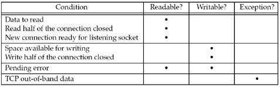
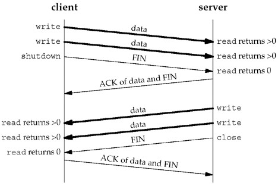
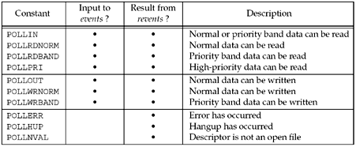

## Scenarios:

* when client handling multiple descriptors(interactive input and network socket)
* client handles multiple sockets at the same time
* tcp server handles both listening and connected sockets
* a server handles both tcp and udp
* a server handles multiple services and multiple protocols

#### 6.3 select
* prototype
* int select(int maxfdp1, fd_set *readset, fd_set *writeset, fd_set *exceptset, const struct timeval *timeout);
* returns: positive count of ready descriptors, 0 on timeout, –1 on error

#### 6.5 Shutdown function
* limitation of close function:
1. Decrease the descriptors's reference count and close socket **only if the count reach 0**
* [note] with shutdown , we can initiate TCP's normal connection termination sequence

2. Close terminates both direction of data transfer, reading and writing

* prototype --- int shutdown(int sockfd, int howto);

| ---howto---- | ---action---      |
| ------------ | ----------------- |
| SHUT_RD      | read half closed  |
| SHUT_WR      | write half closed |
| SHUT_RDWR    | both closed       |

#### 6.8 TCP echo server
* use select to monitor connection from accept
* decrease postive count of ready descriptors until reach 0
* problems --- soulution refer 16.6
*  1. listening socket blocks, need non-blocking version???
*  2. error return from accept
*  3. Dos attack

#### 6.9 pselect
* compared with select
*  1. use *timespec* structure
*  2. adds a sixth argument: a pointer to a signal mask

#### 6.10
* poll originated with SRV3 and limited to STREAMS devices
* SRV4 remove these limitation, allowing work with any descriptor
* prototype:
* --- int poll (struct pollfd *fdarray, unsigned long nfds, int timeout);
* --- Returns: count of ready descriptors, 0 on timeout, –1 on error

* it's caller's responsibility to allocate an array of **pollfd** structure, so we don't have the problem with **FD_SETSIZE** by select function

#### 6.11
* for tcpservpoll01, **POLLRDNORM** or **POLLERR** may return based on different implementation, so need to monitor both of them on **revents**.
