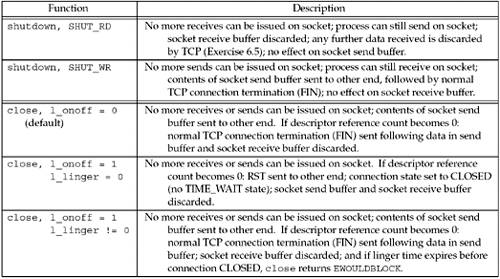
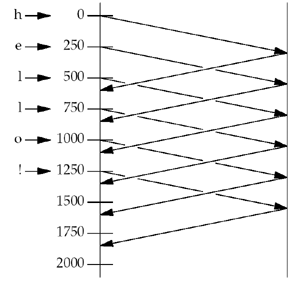
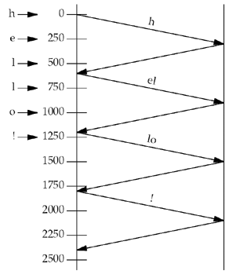
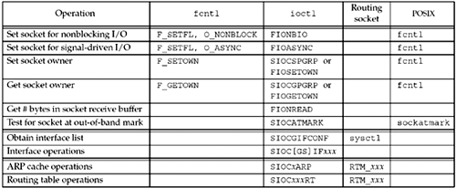

* SO_USELOOPBACK is not a POSIX standard, in case of debug, check with #ifdef

#### 7.5 Generic socket option
###### SO_LINGER
+ 1 close with linger option on, provide a chance for client to receive *FIN* from server, but does not guarantee **FIN** finally received.



###### SO_RCVBUF/SO_SNDBUF
+ 1 change default size with this two options
+ 2 setting diff with client and server, on client, setting SO_RCVBUF before calling connect; on server, before calling listen ---> have no effect on window scale option
+ 3 TCP socket buffer size should be **at least four times the MSS** for the connection.
+ 4 dealing with performance --- client tcp must keep a copy of each segment until ACK is received

###### SO_RCVLOWAT/SO_SNDLOWAT
+ 1 consider sencarios with select to any specific descriptor to be "readable" or "writable"

###### SO_USELOOPBACK
* applies only in routing domain(AF_ROUTE)
* when enabled, socket receive a copy of everything sent on the socket

#### 7.6 IPv4 socket option

###### IP_HDLINCL
* must build own IP header for all datagrams we send on the raw socket

#### 7.7 ICMPv6 socket option

#### 7.8 IPv6 socket option

#### 7.9 TCP socket option
###### TCP_NODELAY
* disable Nagle algorithm if set.
* Nagle algorithm: reduce the number of small packets on a WAN.



#### 7.10 STCP socket option

#### 7.11 fcntl function --- stand for "file control"

* fcntl provide:
* * Nonblocking IO --- with O_NONBLOCK flag
* * signal-driven IO --- with O_ASYNC flag, which cause
* * F_SETOWN cmd lets set socket owner(PID or PGID) to receive *SIGIO* and *SIGURG*

```
#include <fcntl.h>
int fcntl(intfd, int cmd, ... /* int arg */ );
Returns: depends on cmd if OK, -1 on error
```
* typical pseudo-code
* + 1 fetch current flags
* + 2 join the expected flag
```
int     flags;

     /* Set a socket as nonblocking */
if  ( (flags = fcntl (fd, F_GETFL, 0)) < 0)
    err_sys("F_GETFL error");
flags |= O_NONBLOCK; // mark nonblocking
if (fcntl(fd, F_SETFL, flags) < 0)
    err_sys("F_SETFL error");
/* clear nonblocking socket */
flags &= ~O_NONBLOCK
fcntl(fd, F_SETFL, flags)
```
