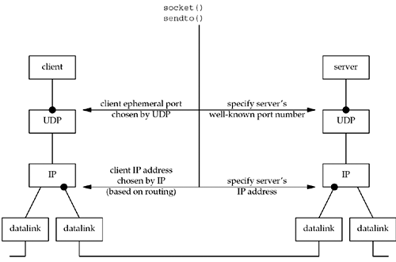
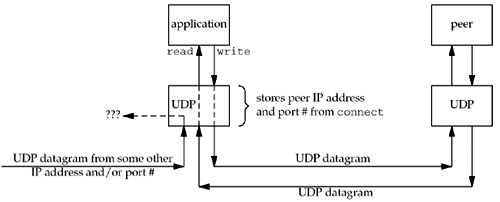

##### 8.8 verifying received response

* The IP address returned from recvfrom is not the IP address to which we sent the datagram.
* If server not bound an IP address to its socket, the kernel chooses the src address for the IP datagram, the choosen one is likely to be the *PRIMARY* IP address of outgoing interface, if we send our datagram to a nonprimary IP address, which in turn, unlikely to get the expected response from server --- solution: client verify with the responding host's domain instead of itps IP address.

##### 8.9 server not running

* in this case, client blocks forever with recvfrom
* icmp message only received by kernel but never deliverd to process
* if want to receive this icmp message, a connected UDP socket is needed.

##### 8.10 summary of UDP example

* the client's IP address can change from every UDP datagram that the client sends --- client does not **bind** a specific IP address to the socket.

* See bleow scenario: client host is multihomed.

* left and right datalink represent two destinations
* in this scenario, client's IP address, as chosen by kernel based on outgoing datalink, would changed for every datagram.
* Q: what happens IF client binds an IP addr, but kernel decides that an outgoing datagram must be sent out some other datalink ?
* A: IP datagram will **contain a source IP address** that is different from the IP address of the outgoing datalink

* different with unconnect UDP in three ways:
*  + 1 send data: use send/write instead of sendto
*  + 2 recv data: use recv/read  instead of recvfrom
*  + 3 ASNY errors are returned to the process if connected

##### 8.13 Lack of flow control with UDP

* packet count on server equals received datagrams plus dropped count due to full socket buffers
* server's receive buff can be set with **SO_RCVBUF** option, but only performs slightly better compared to dgecholoop1.c

##### 8.14 Determining outgoing IF with UDP

* see udpcli09.c, each time we issue a connect operation, we get different outgoing IF with getsockname function
