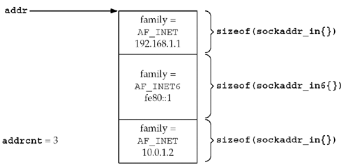
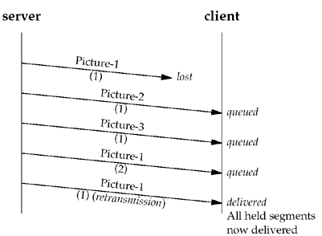
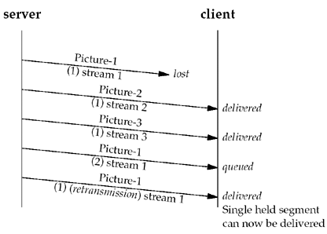

##### 9.2 IF models

* two types of SCTP sockets: one-to-one and one-to-many
* things to consider when chose the type:
* + 1 server type --- interative or concurrent?
* + 2 how many socket desc does the server wish to manage?
* + 3 is it important to optimize the association setup to enable data on the third packet of the four-way handshake?
* + 4 how many connection state does the app wish to maintain?

##### 9.3 sctp_bindx

* has the ablity to bind a subset of IP address associated with the host system.

##### 9.4 sctp_connectx

* used to connect to a multihomed peer
* packed address list format for SCTP calls
  

##### 9.5 sctp_getpaddrs

* to retrieve **all the addresses** of a peer

##### 9.6 sctp_freepaddrs

* frees resources allocated by sctp_getpaddrs

##### 9.7 sctp_getladdrs

* to retrieve the local addresses that are part of an association
* when wish to know exactly which local addr are in use(be may a proper subset)

##### 9.8 sctp_freeladdrs

* frees resources allocated by sctp_getladdrs

##### 9.9 sctp_sendmsg

* caller must specify an SCTP stream number

##### 9.10 sctp_recvmsg

* arg sg_flags allow user to retrieve more infomation
* if sctp_sndrcvinfo to be received, sctp_data_io_event msut be subscribed to with **SCTP_EVENTS** option

##### 9.11 sctp_opt_info

* is a library call the **repackages th arguments** into the appropriate getsockop call

##### 9.12 sctp_peeloff

* extract an association (contained by one-to-many socket) into an **individual** one2one socket

##### 9.13 shutdown

* SCTP's design doesn't provide a *half-closed* state

##### 9.14 notifications

* provide a variety of notifications to app programmer

### ch10 SCTP cli/ser example

##### 10.5 exploring head-of-line blocking
* A *stream* in SCTP is not a stream of bytes(as in TCP), but **a sequence of messages**
* head-of-line issue occurs with normal TCP connection

##### 10.6 controlling the number of streams

* system normally has default stream number, to say, 10 for some systems
* this can be changed by setting options at *IPPROTO_SCTP* level before bind operation

##### 10.7 controlling termination

* two alternative ways:
*  + 1 apply **MSG_EOF** --- server wish to shutdown an association
*  + 2 apply **MSG_ABORT** --- force an immediate termination
